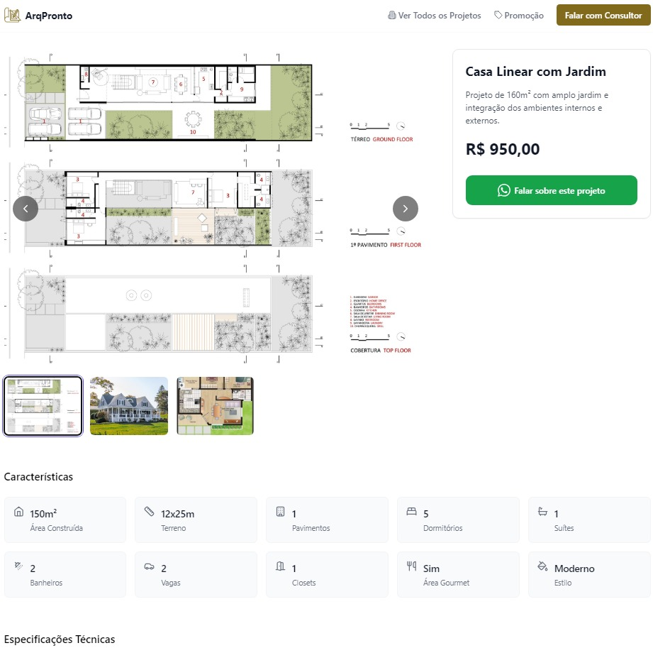

# ArqPronto

<div align="center">
  
  <p><em>Projeto de arquitetura e design de interiores</em></p>
</div>

## 📋 Descrição

Sistema web completo para **vendas de projetos de arquitetura** com painel administrativo avançado, tracking de conversões e funcionalidades de edição em tempo real. O sistema permite gerenciar um catálogo de projetos arquitetônicos com visualização, filtragem, contato via WhatsApp e análise de performance através do Facebook Pixel.

## 🖼️ Screenshots

### 🏠 Página Principal

*Interface principal do sistema com catálogo de projetos*

### 📋 Cabeçalho e Navegação

*Sistema de navegação e filtros do catálogo*

### 💰 Página de Vendas

*Detalhes completos do projeto com especificações técnicas*

## 🔧 Funcionalidades Administrativas Completas

### 🏠 Dashboard Administrativo
- **Estatísticas em Tempo Real**: Visualização do total de projetos e projetos ativos
- **Interface Intuitiva**: Painel centralizado para gerenciamento completo do sistema
- **Navegação Rápida**: Acesso direto a todas as funcionalidades administrativas

### 📋 Gerenciamento de Projetos
- **CRUD Completo**: Criar, visualizar, editar e excluir projetos
- **Upload de Imagens**: Sistema avançado de upload com preview e reordenação
- **Campos Detalhados**:
  - Informações básicas (título, descrição, tipo, preço)
  - Promoções com data de início e fim
  - Detalhes técnicos (quartos, suítes, banheiros, vagas, closets)
  - Especificações (área total, dimensões da casa e terreno)
  - Status (ativo/inativo) e destaque
  - Áreas internas e externas
  - Itens inclusos no projeto

### 🖼️ Sistema de Upload de Imagens
- **Upload Múltiplo**: Envio de várias imagens simultaneamente
- **Preview em Tempo Real**: Visualização imediata das imagens carregadas
- **Reordenação**: Arrastar e soltar para reorganizar imagens
- **Otimização Automática**: Compressão e redimensionamento automático
- **Barra de Progresso**: Acompanhamento visual do upload
- **Validação**: Verificação de formato e tamanho dos arquivos

### ⚙️ Configurações do Site
- **Informações de Contato**: Número do WhatsApp para leads
- **Redes Sociais**: Links para Instagram, Facebook, YouTube
- **SEO Avançado**:
  - Meta descrição personalizada
  - Meta imagem para compartilhamento
  - Logo do site
- **Gerenciamento de Banners**:
  - Upload de banners desktop e mobile
  - Reordenação por arrastar e soltar
  - Adição e remoção dinâmica de banners

### 📊 Facebook Pixel Integration
- **Configuração Dinâmica**: ID do Pixel configurável via painel admin
- **Tracking Automático**:
  - PageView: Rastreamento de visualizações de página
  - Lead: Rastreamento de conversões (contatos via WhatsApp)
- **Implementação Completa**: Script e noscript para máxima compatibilidade
- **Eventos Personalizados**: Tracking de ações específicas do usuário

### 🔐 Sistema de Autenticação
- **Login Seguro**: Autenticação com email e senha
- **Sessão Persistente**: Manutenção de login entre sessões
- **Proteção de Rotas**: Acesso restrito às áreas administrativas
- **Logout Automático**: Redirecionamento em caso de sessão expirada

### 🎯 Funcionalidades de Edição Avançadas

#### Edição de Projetos
- **Formulário Dinâmico**: Interface responsiva para todos os campos
- **Validação em Tempo Real**: Verificação instantânea de dados
- **Auto-save**: Salvamento automático de rascunhos
- **Histórico de Alterações**: Rastreamento de modificações

#### Gerenciamento de Imagens
- **Editor Visual**: Interface drag-and-drop para organização
- **Múltiplos Formatos**: Suporte a JPG, PNG, WebP
- **Compressão Inteligente**: Otimização automática para web
- **Backup Automático**: Armazenamento seguro no Supabase Storage

#### Filtros e Busca Administrativa
- **Busca Avançada**: Pesquisa por título, descrição e características
- **Filtros Múltiplos**:
  - Por tipo de projeto
  - Por status (ativo/inativo)
  - Por promoção ativa
  - Por destaque
- **Paginação**: Navegação eficiente em grandes volumes de dados
- **Ordenação**: Classificação por data, preço, popularidade

#### Recursos de Produtividade
- **Ações em Lote**: Operações múltiplas simultâneas
- **Duplicação de Projetos**: Criação rápida baseada em templates
- **Exportação de Dados**: Relatórios em diversos formatos
- **Backup e Restauração**: Proteção completa dos dados

### 📱 Interface Responsiva
- **Design Adaptativo**: Funciona perfeitamente em desktop, tablet e mobile
- **Touch-Friendly**: Otimizado para dispositivos touch
- **Performance**: Carregamento rápido e navegação fluida

### 🔄 Integração com Supabase
- **Banco de Dados**: PostgreSQL com queries otimizadas
- **Storage**: Armazenamento seguro de imagens e arquivos
- **Real-time**: Atualizações em tempo real
- **Backup Automático**: Proteção completa dos dados

## 🚀 Tecnologias Utilizadas

- **Frontend:** React + TypeScript
- **Build Tool:** Vite
- **Styling:** Tailwind CSS
- **Backend:** Supabase
- **Runtime:** Node.js

## 📈 Sistema de Tracking e Analytics

### Facebook Pixel Avançado
- **Configuração Dinâmica**: ID do Pixel configurável via painel administrativo
- **Eventos Rastreados**:
  - `PageView`: Todas as visualizações de página
  - `Lead`: Conversões via WhatsApp (botões de contato)
  - `ViewContent`: Visualização de detalhes de projetos
- **Implementação Técnica**:
  ```javascript
  // Inicialização automática do pixel
  initFacebookPixel(pixelId)
  
  // Tracking de eventos
  trackEvent('Lead', { content_name: 'WhatsApp Contact' })
  trackPageView()
  ```

### Métricas de Conversão
- **Rastreamento de Leads**: Cada clique no WhatsApp é registrado como conversão
- **Funil de Vendas**: Acompanhamento completo da jornada do cliente
- **ROI de Campanhas**: Medição do retorno sobre investimento em anúncios
- **Segmentação de Audiência**: Criação de públicos personalizados no Facebook

### Analytics Integrado
- **Dados em Tempo Real**: Estatísticas atualizadas instantaneamente
- **Relatórios Automáticos**: Geração de relatórios de performance
- **Integração com Facebook Ads**: Otimização automática de campanhas
- **Tracking Cross-Device**: Acompanhamento entre dispositivos

## 📁 Estrutura do Projeto

```
ArqPronto/
├── src/                 # Código fonte da aplicação frontend
├── api/                 # API backend
├── admin/               # Painel administrativo
├── database/            # Scripts e esquemas do banco de dados
├── docs/                # Documentação do projeto
├── public/              # Arquivos estáticos (imagens, ícones)
│   ├── logo.png         # Logo do projeto
│   ├── logo.svg         # Logo em formato vetorial
│   └── screenshots/     # Screenshots da aplicação (criar esta pasta)
└── README.md            # Este arquivo
```

## ✨ Recursos de UX e Edição Avançados

### Interface de Usuário Moderna
- **Design Responsivo**: Adaptação perfeita para todos os dispositivos
- **Animações Suaves**: Transições fluidas e micro-interações
- **Loading States**: Indicadores visuais de carregamento
- **Toast Notifications**: Feedback instantâneo para ações do usuário
- **Modal Dialogs**: Confirmações e formulários em overlay

### Experiência de Edição
- **Drag & Drop**: Interface intuitiva para reordenação de elementos
- **Preview em Tempo Real**: Visualização instantânea das alterações
- **Auto-save**: Salvamento automático para evitar perda de dados
- **Validação Inteligente**: Verificação em tempo real com feedback visual
- **Undo/Redo**: Histórico de ações para desfazer alterações

### Upload de Arquivos Avançado
- **Multiple File Upload**: Seleção e upload de múltiplos arquivos
- **Progress Tracking**: Barra de progresso individual por arquivo
- **Image Optimization**: Compressão automática para web
- **Format Validation**: Verificação de tipos de arquivo permitidos
- **Size Limits**: Controle de tamanho máximo de upload

### Filtros e Busca Inteligente
- **Search as You Type**: Busca instantânea conforme digitação
- **Multiple Filters**: Combinação de múltiplos critérios de filtro
- **Filter Persistence**: Manutenção de filtros entre sessões
- **Quick Filters**: Filtros rápidos para categorias populares
- **Advanced Search**: Busca avançada com operadores lógicos

### Performance e Otimização
- **Lazy Loading**: Carregamento sob demanda de imagens
- **Image Compression**: Otimização automática de imagens
- **Caching Strategy**: Cache inteligente para melhor performance
- **Bundle Optimization**: Código otimizado para carregamento rápido
- **SEO Friendly**: URLs amigáveis e meta tags otimizadas

### Acessibilidade
- **Keyboard Navigation**: Navegação completa via teclado
- **Screen Reader Support**: Compatibilidade com leitores de tela
- **High Contrast**: Suporte a modo de alto contraste
- **Focus Management**: Gerenciamento adequado do foco
- **ARIA Labels**: Rótulos adequados para tecnologias assistivas

## ⚙️ Instalação

```bash
# Clone o repositório
git clone https://github.com/Marcos934/ArqPronto.git

# Entre no diretório
cd ArqPronto

# Instale as dependências
npm install

# Execute o projeto em modo de desenvolvimento
npm run dev
```

## 🔒 Segurança e Melhores Práticas

### Autenticação e Autorização
- **Supabase Auth**: Sistema de autenticação robusto e seguro
- **JWT Tokens**: Tokens seguros para manutenção de sessão
- **Role-Based Access**: Controle de acesso baseado em funções
- **Session Management**: Gerenciamento seguro de sessões
- **Password Security**: Políticas de senha seguras

### Proteção de Dados
- **Environment Variables**: Variáveis sensíveis em arquivos .env
- **API Key Protection**: Chaves de API protegidas no servidor
- **Data Validation**: Validação rigorosa de entrada de dados
- **SQL Injection Prevention**: Proteção contra injeção SQL
- **XSS Protection**: Prevenção de ataques Cross-Site Scripting

### Upload Seguro
- **File Type Validation**: Verificação de tipos de arquivo permitidos
- **Size Limitations**: Limites de tamanho para uploads
- **Virus Scanning**: Verificação de malware em uploads
- **Secure Storage**: Armazenamento seguro no Supabase Storage
- **Access Control**: Controle de acesso a arquivos uploadados

### Monitoramento e Logs
- **Error Tracking**: Rastreamento de erros em produção
- **Performance Monitoring**: Monitoramento de performance
- **Security Logs**: Logs de segurança e tentativas de acesso
- **Backup Strategy**: Estratégia de backup automático
- **Disaster Recovery**: Plano de recuperação de desastres

### Compliance e Privacidade
- **LGPD Compliance**: Conformidade com a Lei Geral de Proteção de Dados
- **Cookie Policy**: Política de cookies transparente
- **Data Retention**: Políticas de retenção de dados
- **User Consent**: Gerenciamento de consentimento do usuário
- **Privacy by Design**: Privacidade incorporada no design

## 🌐 Deploy

O projeto está configurado para deploy automático no Netlify.

## 🔌 APIs e Integrações

### Supabase Integration
- **Database API**: CRUD operations com PostgreSQL
- **Storage API**: Upload e gerenciamento de arquivos
- **Auth API**: Autenticação e autorização
- **Real-time API**: Atualizações em tempo real

### WhatsApp Integration
- **Direct Links**: Links diretos para conversas no WhatsApp
- **Pre-filled Messages**: Mensagens pré-preenchidas com informações do projeto
- **Mobile Optimization**: Otimizado para dispositivos móveis
- **Analytics Integration**: Tracking de cliques e conversões

### Facebook Pixel API
- **Event Tracking**: Rastreamento de eventos personalizados
- **Conversion Tracking**: Medição de conversões e ROI
- **Audience Building**: Criação de audiências personalizadas
- **Campaign Optimization**: Otimização automática de campanhas

### Image Processing
- **Automatic Compression**: Compressão automática de imagens
- **Format Conversion**: Conversão para formatos otimizados
- **Responsive Images**: Geração de múltiplos tamanhos
- **CDN Integration**: Distribuição via CDN para performance

### SEO APIs
- **Meta Tags Generation**: Geração automática de meta tags
- **Sitemap Generation**: Criação automática de sitemap
- **Schema Markup**: Marcação estruturada para SEO
- **Open Graph**: Otimização para compartilhamento social

### Analytics APIs
- **Google Analytics**: Integração com GA4
- **Facebook Analytics**: Métricas detalhadas do Facebook
- **Custom Events**: Eventos personalizados de negócio
- **Conversion Funnels**: Análise de funis de conversão

## 📸 Como Adicionar Imagens ao README

Para adicionar imagens que apareçam corretamente no GitHub:

### 1. **Imagens Locais (Recomendado)**
```markdown

```

### 2. **Imagens com Dimensões Específicas**
```html

```

### 3. **Galeria de Imagens**
```html
<div align="center">
  
  
</div>
```

### 📝 Dicas Importantes:
- Coloque as imagens na pasta `public/screenshots/`
- Use formatos `.png`, `.jpg` ou `.gif`
- Mantenha tamanhos de arquivo pequenos (< 1MB)
- Use nomes descritivos para as imagens
- Sempre adicione texto alternativo (`alt`)

---

<div align="center">
  <p>Desenvolvido com ❤️ por <a href="https://github.com/Marcos934">Marcos Vinicius Mulinari</a></p>
</div>